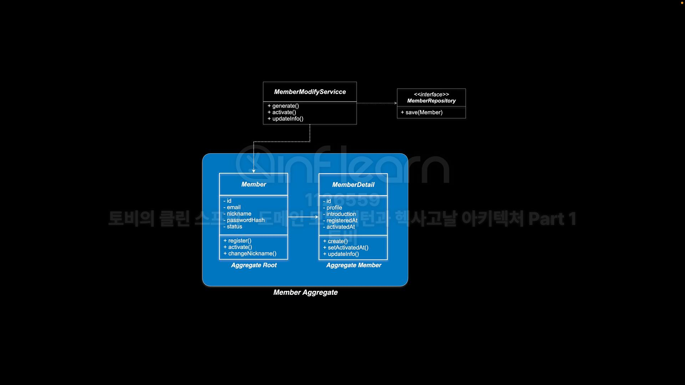

# 애그리거트(Aggregate)
- DDD에 소개된 **도메인 모델 구성 요소/패턴**의 하나
- **데이터 변경의 목적**을 위해 **하나의 단위로 취급**하는 **연관된 객체들의 클러스터**이다.
- 루트(root, 외부에 노출)와 경계(boundary)를 가진다.

#### 특징
- 데이터 변경 시 하나의 단위로 취급 -> 데이터 변경의 일관성을 유지
- 루트를 통한 접근 제어 : 외부 객체는 루트 엔티티에만 참조를 가진다.
- 데이터 일관성 유지
  - 경계 내의 어떤 변경 사항이 있을 때 전체 애그리거트의 모든 **불변식이 충족** 되어야 한다.
  - 애그리거트를 넘어서는 불변식은 이벤트나 배치 등을 통해 특정 시간 내에 해결한다.
- 검색 및 접근 방식: Repository를 통해서 애그리거트 루트만 직접 얻을 수 있다.
  - 내부 엔티티는 루트로부터 연관관계를 통해서 접근한다.
- 생명주기 관리 캡슐화: Factory와 Repository를 이용해서 객체들을 생명주기에 걸쳐 의미있게 조작한다.

#### 목표
- 불변식을 유지하는 수단, 일관성 유지!!
- 이해 용이성: 객체의 시작과 끝이 명확해져 모델을 더 쉽게 이해가능
- 트랜잭션 및 동시성 관리: 트랜잭션 범위와 데이터 일관성 유지 방법 제공
- 모델 단순화: 연관 관계 탐색을 제한하고, 루트를 통해서만 접근하도록 해준다.

#### 애그리거트 적용 방법
- JPA의 cascading 을 적절하게 활용한다.(Member -> cascade -> MemberDetail)
- 레포지토리는 애그리거트 단위로 만든다.(스프링 데이터 JPA의 핵심 원칙)
  - 레포지토리 리턴 타입은 애그리거트 루트
- 가능하다면 하나의 트랜잭션에 하나의 애그리거트만 변경.(권장사항)
- 다른 애그리거트의 참조는 애그리거트 루트에 대해서만 한다
  - 연관관계 애그리거트 루트의 참조 대신 루트의 ID 값만 저장하기도 한다.

#### 애그리거트 설계와 적용의 어려움
- 애그리거트 경계 선택이 어렵다.
- 개발하면서 애그리거트 범위가 달라지기도 한다.
  - 대체로 작은 애그리거트가 될 가능성이 높다.
- 성능에 부담을 주게 된다. -> Lazy Loading 으로 하자.
- 내부 엔티티로의 직접 접근이나 여러 애그리거트를 한번에 조회하는 기능이 필요할 때
- **도메인 이벤트**(파트 2에서 설명)와 **최종적 일관성의** 사용이 요구된다.
- 완벽한 애그리거트가 아니어도 괜찮다.

#### 헥사고날 아키텍처와 애그리거트
- **애그리거트 단위로 애플리케이션(헥사곤)을 구성**하는 방법이 유용하다.
- 다른 애그리거트로의 접근은 애플리케이션 포트를 통해서 ID를 전달하는 방식으로
  - 애플리케이션 내부 리포지토리에서 루트 엔티티를 조회하는 방식으로 이루어지게 강제
- 도메인 이벤트와 리스너를 이용해서 애그리거트 사이의 작업을 연결할 수 있다.
  - 이벤트도 루트 ID를 전달
- 애그리거트를 설계하고 각각을 독립적인 애플리케이션으로 분리해보자.

